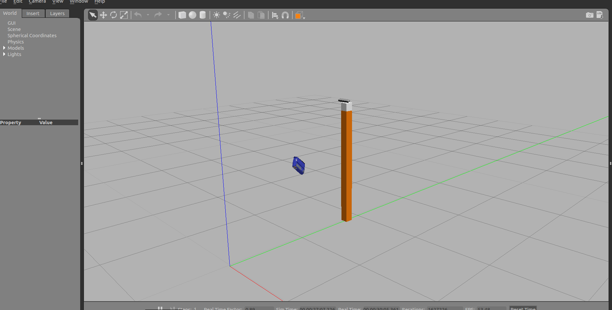
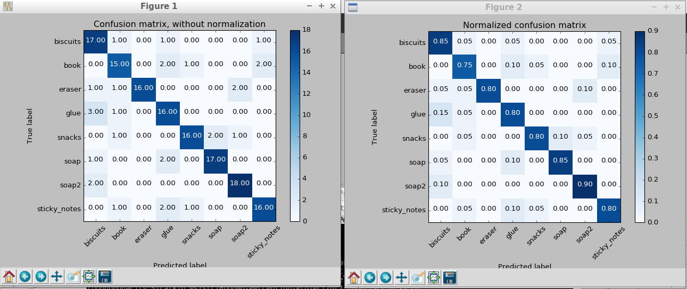
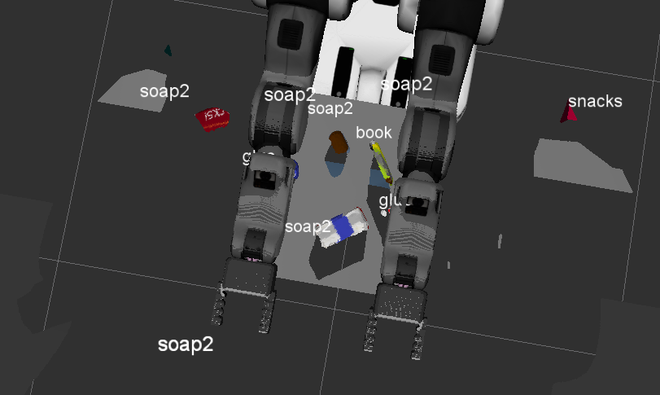

## Project: Perception Pick & Place
---
togawa manabu

# Required Steps for a Passing Submission:
1. Extract features and train an SVM model on new objects (see `pick_list_*.yaml` in `/pr2_robot/config/` for the list of models you'll be trying to identify).
2. Write a ROS node and subscribe to `/pr2/world/points` topic. This topic contains noisy point cloud data that you must work with.
3. Use filtering and RANSAC plane fitting to isolate the objects of interest from the rest of the scene.
4. Apply Euclidean clustering to create separate clusters for individual items.
5. Perform object recognition on these objects and assign them labels (markers in RViz).
6. Calculate the centroid (average in x, y and z) of the set of points belonging to that each object.
7. Create ROS messages containing the details of each object (name, pick_pose, etc.) and write these messages out to `.yaml` files, one for each of the 3 scenarios (`test1-3.world` in `/pr2_robot/worlds/`).  See the example `output.yaml` for details on what the output should look like.  
8. Submit a link to your GitHub repo for the project or the Python code for your perception pipeline and your output `.yaml` files (3 `.yaml` files, one for each test world).  You must have correctly identified 100% of objects from `pick_list_1.yaml` for `test1.world`, 80% of items from `pick_list_2.yaml` for `test2.world` and 75% of items from `pick_list_3.yaml` in `test3.world`.
9. Congratulations!  Your Done!

## [Rubric](https://review.udacity.com/#!/rubrics/1067/view) Points
### Here I will consider the rubric points individually and describe how I addressed each point in my implementation.  

---
### Writeup / README

#### 1. Provide a Writeup / README that includes all the rubric points and how you addressed each one.  

Here's project I implimanted. code is located in
`pr2_robot/scripts/project_template.py`

### Exercise 1, 2 and 3 pipeline implemented
#### 1. Complete Exercise 1 steps. Pipeline for filtering and RANSAC plane fitting implemented.

Applying a `Pass Through Filter` to remove usuless data from point cloud data.

I choose these number with tryout.

```
filter_axis = 'z'
axis_min = 0.6  
axis_max = 1.3
```

To remove table from the scene, use `Randon Sample Consensus / RANSAC` algorithm with plane model.

use PLC library to make RANSAC place segmentation sections.

Max distance for a point to be considered fitting the model
Experiment with different value. I choose max_distance = 0.01

```
seg = cloud_filtered.make_segmenter()

seg.set_model_type(pcl.SACMODEL_PLANE)
seg.set_method_type(pcl.SAC_RANSAC)

max_distance = 0.01 #0.02
seg.set_distance_threshold(max_distance)

inliers, coefficients = seg.segment()
```

and extract table and objects.

```
cloud_objects = cloud_filtered.extract(inliers, negative=True)
cloud_table = cloud_filtered.extract(inliers, negative=False)
```

#### 2. Complete Exercise 2 steps: Pipeline including clustering for segmentation implemented.  

Learned K-means, DBSCAN. DBSCAN is good to use when we don't know how many clusters to expect in point.

Use PCL's Euclidean Clustering algorithm to segment the points into individual objects.

Create only spatial infomation cloud and k-d tree.

```
white_cloud = XYZRGB_to_XYZ(cloud_objects)
tree = white_cloud.make_kdtree()
```

Cluster extraction, find these parameters with experiment.

```
ec = white_cloud.make_EuclideanClusterExtraction()

ec.set_ClusterTolerance(0.016)
ec.set_MinClusterSize(30)
ec.set_MaxClusterSize(3000)

ec.set_SearchMethod(tree)
cluster_indices = ec.Extract()
```


#### 2. Complete Exercise 3 Steps.  Features extracted and SVM trained.  Object recognition implemented.

Use `capture_features.py` script to capture and save features for each objects.

This script bring each object in random orientations and computes features based on the point clouds.

`rosrun pr2_robot capture_features.py`



From this script `training_set.sav` file, containing the features and labels for the dataset.

Use `train_svm.py` script to train SVM classifier.

`rosrun pr2_robot train_svm.py`

When this script runs shows confusion matrix for this classifier.
On the left is raw counts and on the right as a percentage of the total.

I got 75-90% accurate data for 8 objects.



Now ready to do object recognition for PR2 robot.

Load model from disk

```
model = pickle.load(open('model.sav', 'rb'))
clf = model['classifier']
```

loop through each of the segmented clusters

```
for index, pts_list in enumerate(cluster_indices):
      # Grab the points for the cluster
      pcl_cluster = cloud_objects.extract(pts_list)
```

Extract features from color and normal histograms

```      
      #extract histogram features
      chists = compute_color_histograms(ros_cluster, using_hsv=True)
      normals = get_normals(ros_cluster)
      nhists = compute_normal_histograms(normals)
      feature = np.concatenate((chists, nhists))

```

Make the prediciction.

```      
      prediction = clf.predict(scaler.transform(feature.reshape(1,-1)))
      label = encoder.inverse_transform(prediction)[0]

```

Throw there pipeline I implemented object recognition from rgb-d camera point cloud data.

### Pick and Place Setup

#### 1. For all three tabletop setups (`test*.world`), perform object recognition, then read in respective pick list (`pick_list_*.yaml`). Next construct the messages that would comprise a valid `PickPlace` request output them to `.yaml` format.

`rosrun pr2_robot project_template.py` to run projects.


